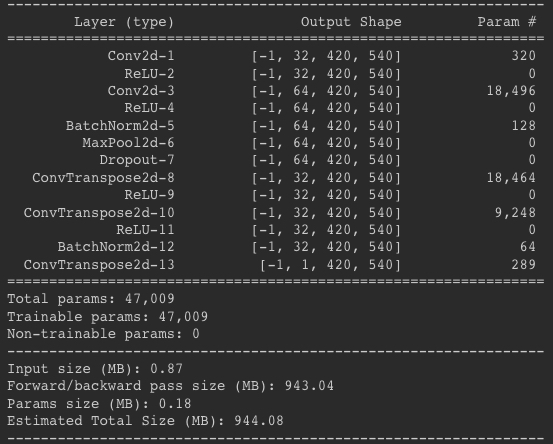

# DenoisingDirtyDocuments
### Document denoising using Autoencoder

### Basic information:
- Pytorch.
- [Dataset](https://www.kaggle.com/c/denoising-dirty-documents).
- Training took approximately 30 min for 100 epochs using Google Colab.

### Architecture:
- Input shape (1, 540 , 420).

### Results
